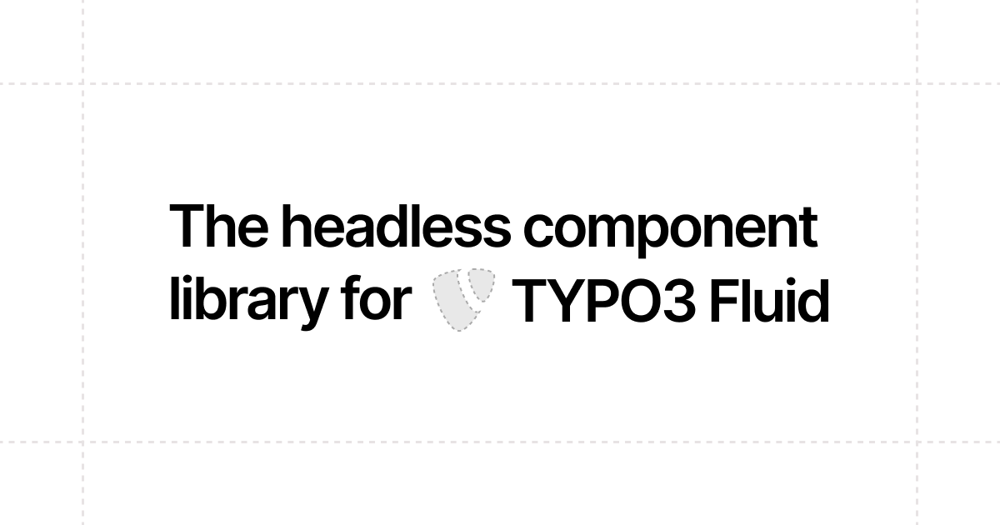

# Fluid Primitives

The headless component library for TYPO3 Fluid

## Documentation

The documentation can be found at [fluid-primitives.com](https://fluid-primitives.com).

## Development

```bash
ddev start
ddev composer install
ddev snapshot restore --latest
ddev npm install
ddev npm run dev
```

Then open [http://fluid-primitives.ddev.site](http://fluid-primitives.ddev.site) in your browser.
