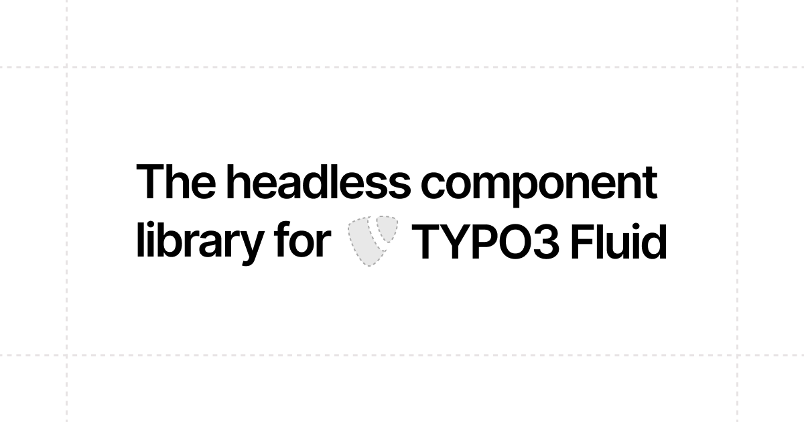

# Fluid Primitives

The headless component library for TYPO3 Fluid

## Documentation

The documentation can be found at [fluid-primitives.com](https://fluid-primitives.com).

## Development

Clone the repo with the fluid-primitives submodule, then run:

```bash
ddev start
ddev composer install
ddev snapshot restore --latest
ddev npm install
ddev npm run dev
```

Then open [https://fluid-primitives.ddev.site](https://fluid-primitives.ddev.site) in your browser.

## Playground

You can find a Playground page under `/playground` where you can test components and context code without modifying the example files.

## Storybook

Run Storybook with:

```bash
ddev npm run storybook
```

and open [fluid-primitives.ddev.site:8080](https://fluid-primitives.ddev.site:8080) in your browser.
